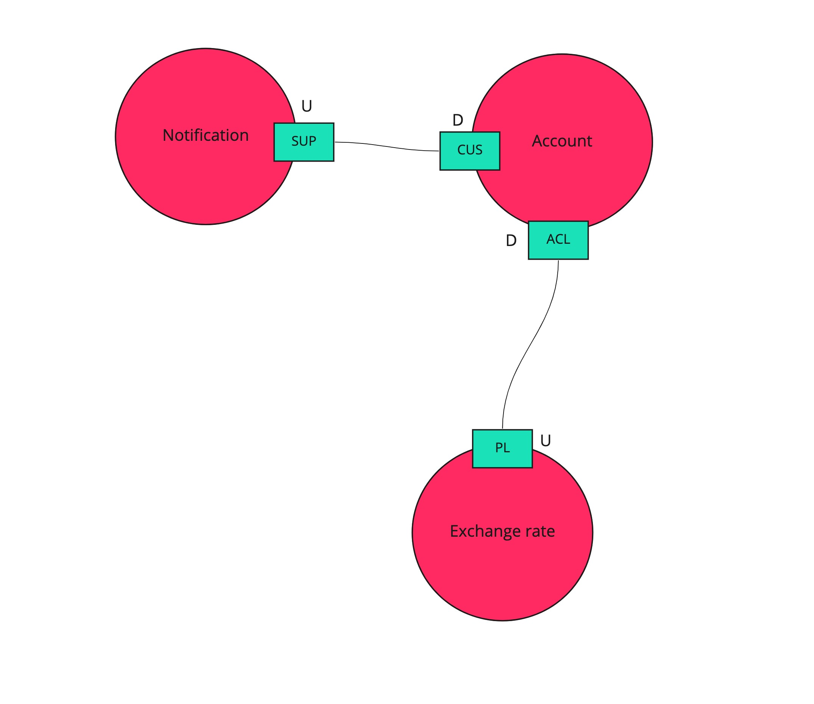
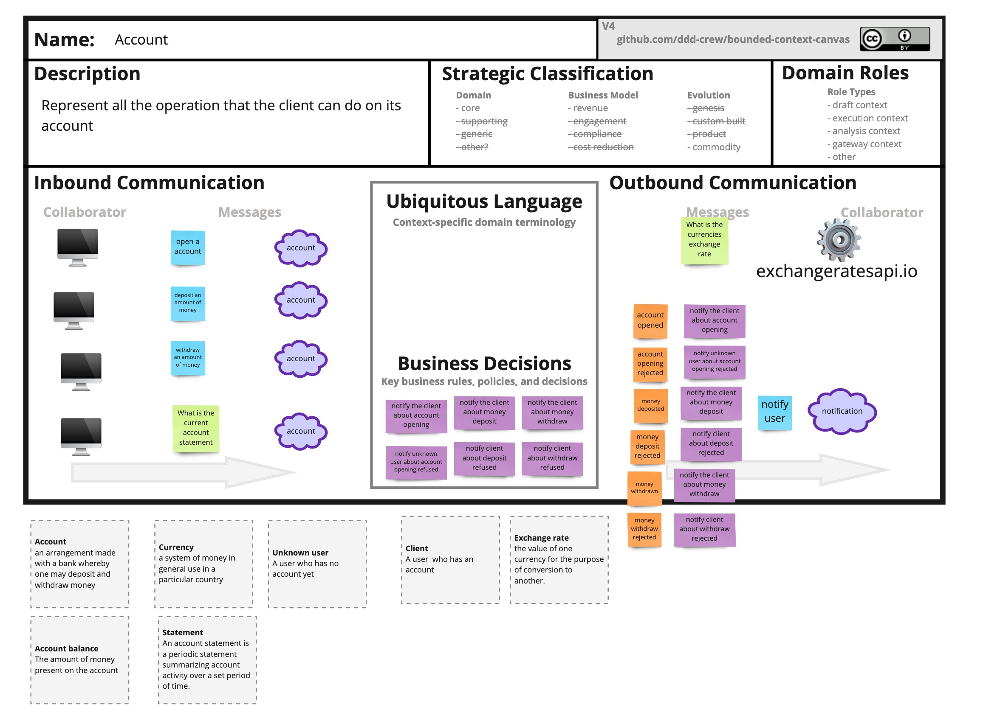
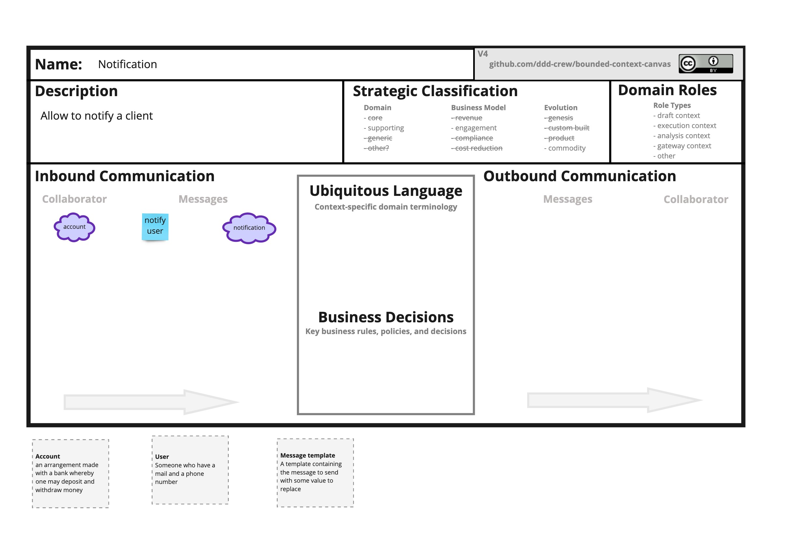
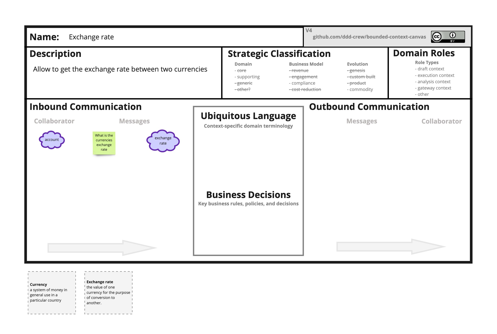

# Banking kata in kotlin

## Purpose

The purpose of this project is to train different pattern like layered architecture, aggregate, command bus, event bus,... doing the Banking Kata (with adapted rules !).
Following a Domain Driven Design methodology and other good practices.

And to learn Kotlin too !!! 🥳

I will try to keep note of what I learned, each time I learn something.

## The domain

A banking system !

- Someone can create an account with a first positive deposit.
  - The deposit is an amount of money in a specified currency.
- An external currency system allows requesting currencies exchange rates. 
- A user can make a deposit of a positive amount of money.
- A user can withdraw a positive amount of money.
  - It's not possible to withdraw more money than the current account balance.
- Each operation is sent to the account owner by mail and instant messaging.

## Design
### Software modeling

Since the case is pretty simple, I only made a Software modeling Event Storming.  

Because of the simplicity of this example we have one bounded context by domain, but it's not always the case.

3 bounded context was discovered during this Event Storming:
- **Account:** the context handling all the account operation
- **Notification:** the context handling the notification to the users
- **Exchange rate:** this one is not visible in the Event Storming because he's only providing an API to get the exchange rate between 2 currencies. It's external service which is only visible has a read model in the Event Storming because he has no transaction or domain rule to validate.

### Context map

### Bounded Context Canvas
#### Account bounded context

This bounded context has only one aggregate: Account.
#### Notification bounded context

This bounded context has only one aggregate: Notification.
#### Exchange rate bounded context

This context will be implemented by the `exchangeratesapi.io` API.

## Some rules
- Use the DDD tactical patterns
  - Aggregate
  - Entity
  - Value object
  - Domain Event
  - Repository
- Logger will be an infra
- No constructor -> only factory method with intention
- 0 ORM
- 0 primitive in the domain

## Reflection
### Projection
There is several ways to implement the projection to a read model:
- as event handler
- by the event store

# TODO
- implement wrong path
- add another currency
