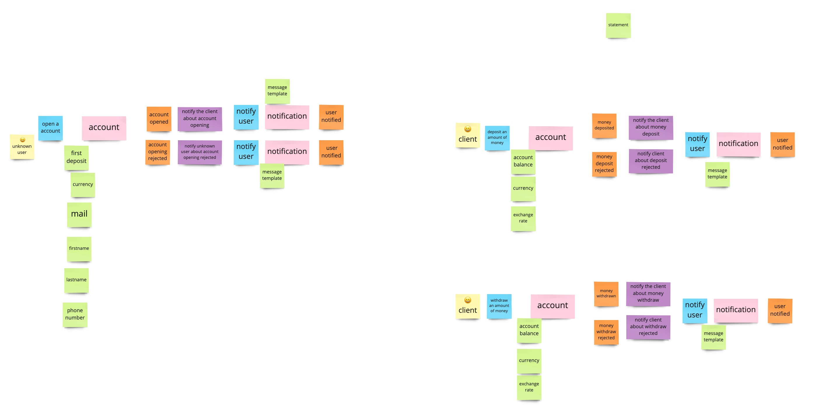

# Banking kata in kotlin

## Purpose

The purpose of this project is to train different pattern like layered architecture, aggregate, command bus, event bus,... doing the Banking Kata (with adapted rules !).
Following a Domain Driven Design methodology and other good practices.

And to learn Kotlin too !!! 🥳

I will try to keep note of what I learned, each time I learn something.

## The domain

A banking system !

- Someone can create an account with a first positive deposit.
  - The deposit is an amount of money in a specified currency.
- An external currency system allows requesting currencies exchange rates. 
- A user can make a deposit of a positive amount of money.
- A user can withdraw a positive amount of money.
  - It's not possible to withdraw more money than the current account balance.
- A user can 
- Each operation is sent to the account owner by mail and instant messaging.

## Some rules
- Logger will be an infra
- No constructor -> only factory method with intention
- 0 ORM
- 0 primitive in the domain
